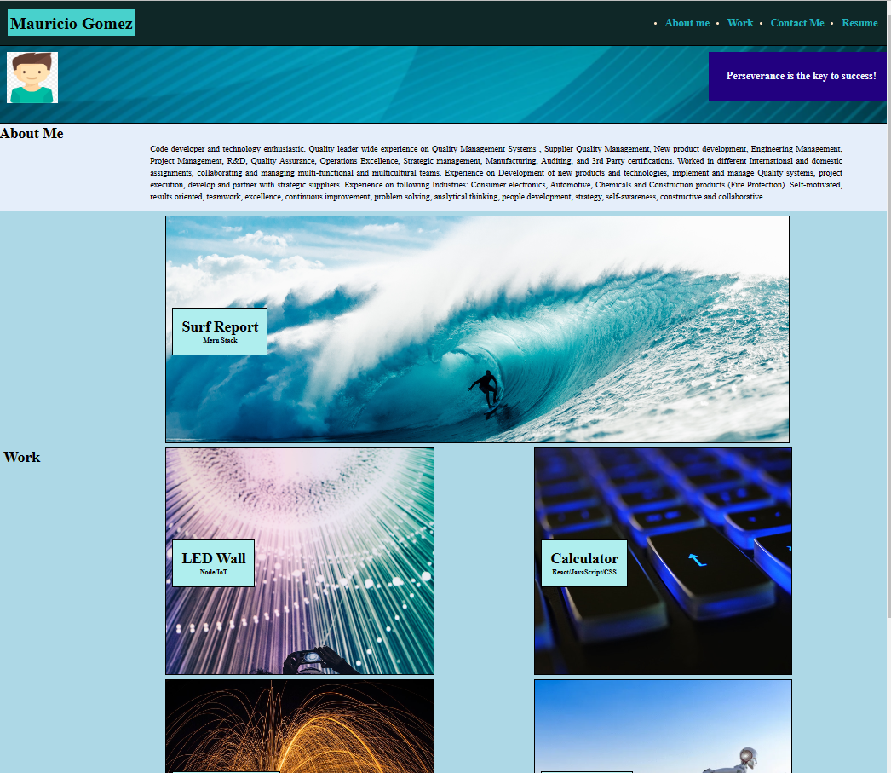
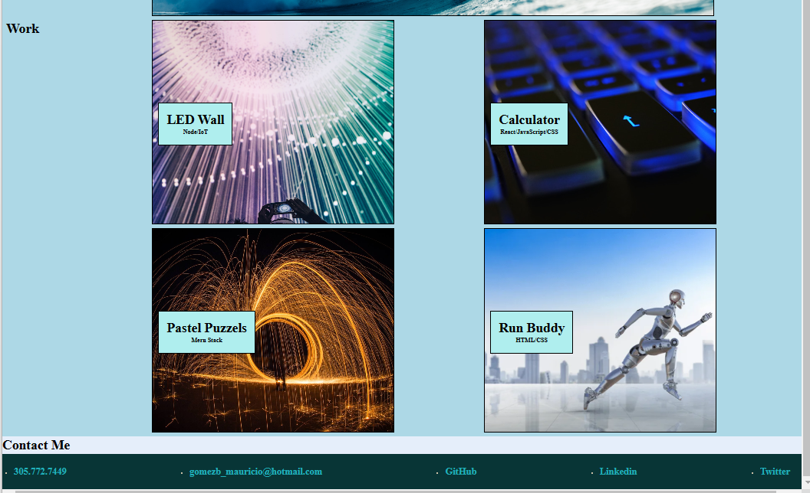

# Professional-Portfolio

## Description

This personal portfolio provides a summary and overview of employee work and information.
- Information of key facts of the applicant
- Picture of the employee
- Work and information of the projects that has been participated.
- Contact information.
- Link to principal webpages to access the information of the employee. 
- Provides an efficient way to see employee information
- Link to access Resume information of the applicant

## Table of Contents (Optional)

If your README is long, add a table of contents to make it easy for users to find what they need.

- [Installation](#installation)
- [Usage](#usage)
- [Credits](#credits)
- [License](#license)

## Installation

Easy navigation to main 

## Usage

- Top left corner name of applicant
- Picture or avatar of the person
- Top left- navigation bar with links for each of the sections listed
- Work section - contain access to work of the applicant
- Bottom section key contact information of the applicant
- Click on each section to be redirected to each of the sections or external websites.

Website:
 https://mauriciogb1.github.io/MAUGB-M2C-Professional-Portfolio-Repository/

## Credits

Images provided by https://www.pexels.com/

## License

Website running under MIT License.

---

## Features

Precise and efficient profile of the candidate with link to each of his work.

External links to the information of the applicant.

Resume of the applicant.
